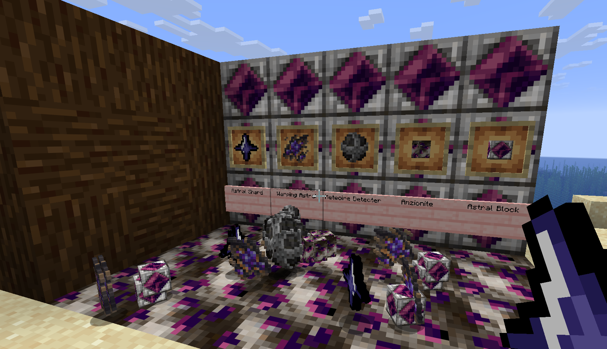

## Shizees Mod

An Alien/Cosmic themed minecraft mod made for neoforge **26.2** which adds custom items/blocks/ores which has some lore behind it!  

## To play the Mod 
* download the jar file from the  github release.
* make sure the version is same and not different.
* make sure it is Neoforge and not Forge.

## Features Included in the Mod 
## Items 

* Warping Astral
* the warping Astral has a unique mechanic that i implemented regarding its lore which involves around the darkness of the **Cosmos**.
* When the sun's light gets radiated on  the warping astral, It begins to shake violently and teleports to its **mothership**.

* Astral Shard
* a stabalized core material acquired by smelting The Anzionite.
* designed to create heavy power transmuting crystallized blocks.

* Meteoite Detecter
* A unique ball made to scan rare ores and specially the meteorite which fell onto the world by **unknown reasons**.
* **it looks good**

## Blocks 
* Anzionite Ore
* A meteorite which fell from unknown origins embedded deep into the world.
* When mining it gives **Warping Astral**

* Astral Block
* A very high Energy densed Block made with the hightly stabalized Astral shard causing it to destabalize.

## Teck Stack 
* Java : JDK 25
* Mod Loader : Neoforge 1.21+
* IDE : Intellij IDEA 

## compatibility with Just enough Items (JEI)
